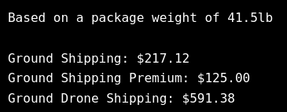
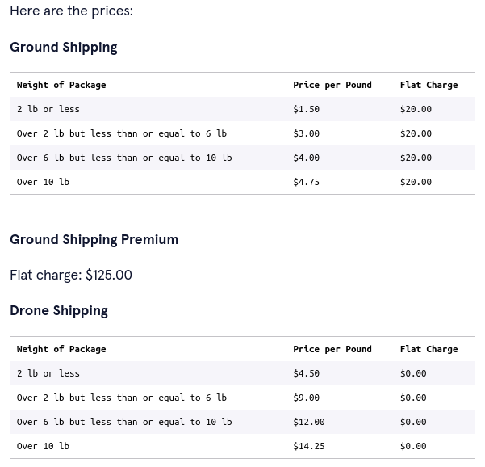

# Sal's Shipping

## Description

A shipping.py Python program that asks the user for the weight of their package and then tells them which method of shipping is cheapest and how much it will cost to ship their package using Sal’s Shippers.

Sal’s Shippers has several different options for a customer to ship their package:

- Ground Shipping, which is a small flat charge plus a rate based on the weight of your package.

- Ground Shipping Premium, which is a much higher flat charge, but you aren’t charged for weight.

- Drone Shipping (new), which has no flat charge, but the rate based on weight is triple the rate of ground shipping.

### Shipping Rates

